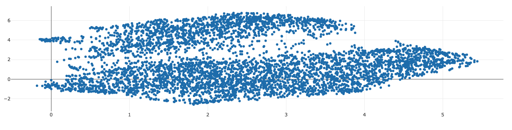

# Topic Map Clustering 
<!-- section: Introduction -->
<!-- Describe briefly what your software is. What problem does it solve? At what target audience is it aimed? -->
This is a proof of concept finding semantic clusters in data done for the Peltarion AI acellerator cohort #3. The goal is to detect semnantic clusters in data. We use a dataset from trip advisor review provided by kaggle (see https://www.kaggle.com/andrewmvd/trip-advisor-hotel-reviews). We then ran this against a [Universal Sentence Encoder](https://peltarion.com/knowledge-center/documentation/modeling-view/build-an-ai-model/blocks/universal-sentence-encoder) model, that was created on [Peltarion](https://peltarion.com) and stored the response (due to optimization and seccurity issues) on AWS S3. You can see the response here: https://dasheck0-public.s3.eu-central-1.amazonaws.com/text_embeddings.json.

It contains the 512-component embedding of the provided texts. This is than shaped into an array of two dimensional vectores using umap and plotted (see screenshot below). We than use a dbscan implementation by turf to detect clusters based on a given distance threshold. Each cluster is written to  `./clusters` with a description. Cluster description is derived by calculating the top terms of each document in the cluster using a `tf-idf` implementation.



Here are some learnings:
- Clustering works. However, it depends vastly on the threshold. Eventually we have to come up with something interactively to determine a proper threshold
- TFIDF is a good starting point but often produces no proper descriptions. However, it gives a good indication whether the threshold is too small (and therefore produces to tiny clusters). Of clusters share the same description calculated by TFIDF we probably can combine the clusters
- We should try the [Sentence XLM-R](https://peltarion.com/knowledge-center/documentation/modeling-view/build-an-ai-model/blocks/xlm-r-encoder) instead of [Universal Sentence Encoder](https://peltarion.com/knowledge-center/documentation/modeling-view/build-an-ai-model/blocks/universal-sentence-encoder), to create embeddings and compare results
- We shape the 512-component embedding of the texts to 2-dimensional vectors, so that we can plot them on a 2D plane. This might result in information loss. We should use higher dimensional vectors and apply dbscan to that to see if we get better quality results.

## Demo
With Reviews about Disneyland (see: https://www.kaggle.com/arushchillar/disneyland-reviews)

https://topic-map-clustering.vercel.app/ 

## Development
<!-- section: Development -->
<!-- If you software is developed within a team you shhould include this section. Describe how to setup thhe project. Include dependencies, conventions and other things to know in order to start developing. In short: After reading this section everyone should be able to develop this piece of software. -->
<!--
Possible subsections

### Commit messages
### How to publish a release
### Tests
-->
### How to setup and run this project
Run the following steps:
```
git clone https://github.com/dasheck0/topic-map-clustering
cd topic-map-clustering
npm i 
node --max-old-space-size=8192 index.js 
```

You probably have to run node with increased heap size due to higher dimensional vectors (which take a lot of heap). Adjust to what your machine is capable of running ;) You may also reduce component size when creating vectors (see index.js:84).

No need to create a `.env` file at the moment, since data is loaded from publically available S3 bucket.

## Contributing
<!-- section: Contributing -->
<!-- Describe what action one should take in order to contribute. Does a certain styleguide has to be adhered. How can one apply changes (i.e. push vs. pull request)? -->
Bug reports and pull requests are welcome on GitHub at https://github.com/dasheck0/topic-map-clustering. This project is intended to be a safe, welcoming space for collaboration, and contributors are expected to adhere to the Contributor Covenant code of conduct.

## License
<!-- section: License -->
<!-- Describe the license under which your software is published. Note that an unlicensed piece of software is most likely never used. So do not skip tihs part! -->
```
MIT License Copyright (c) 2021 Stefan Neidig

Permission is hereby granted, free
of charge, to any person obtaining a copy of this software and associated
documentation files (the "Software"), to deal in the Software without
restriction, including without limitation the rights to use, copy, modify, merge,
publish, distribute, sublicense, and/or sell copies of the Software, and to
permit persons to whom the Software is furnished to do so, subject to the
following conditions:

The above copyright notice and this permission notice
(including the next paragraph) shall be included in all copies or substantial
portions of the Software.

THE SOFTWARE IS PROVIDED "AS IS", WITHOUT WARRANTY OF
ANY KIND, EXPRESS OR IMPLIED, INCLUDING BUT NOT LIMITED TO THE WARRANTIES OF
MERCHANTABILITY, FITNESS FOR A PARTICULAR PURPOSE AND NONINFRINGEMENT. IN NO
EVENT SHALL THE AUTHORS OR COPYRIGHT HOLDERS BE LIABLE FOR ANY CLAIM, DAMAGES OR
OTHER LIABILITY, WHETHER IN AN ACTION OF CONTRACT, TORT OR OTHERWISE, ARISING
FROM, OUT OF OR IN CONNECTION WITH THE SOFTWARE OR THE USE OR OTHER DEALINGS IN
THE SOFTWARE.
```